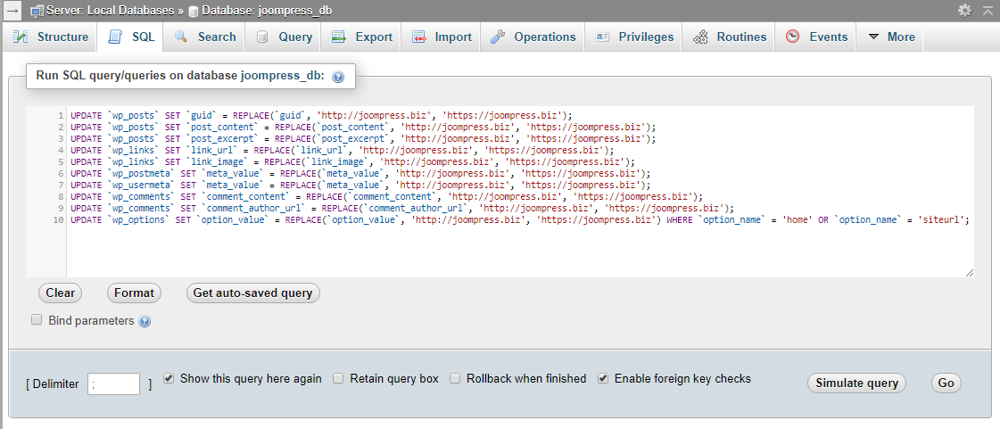

# WordPress SQL Generator
Generate SQL for change URL from old to new

### phpMyAdmin (Run SQL query/queries on database)
Tab **_Databases_** -> Select from list your db (eg: joompress_db) -> Tab **_SQL_** -> Paste SQL into textarea -> Click the button **Go**

To check whether rows are affected, click the **Simulate query** button.
***
Вкладка **_База данных_** -> Выберите из списка свою db (например: joompress_db) -> Вкладка **_SQL_** -> Вставьте SQL в текстовую область -> Нажмите кнопку **Вперед**

Чтобы проверить будут ли затронуты строки нажмите кнопку **Имитировать запрос**
***

### phpMyAdmin (Import into the database)
Tab **_Databases_** -> Select from list your db (eg: joompress_db) -> Tab **_Import_** -> Click the button **Select file** -> Select the file to import (eg: update.sql) -> Click the button **Open** -> Click the button **Go**
***
Вкладка **_База данных_** -> Выберите из списка свою db (например: joompress_db) -> Вкладка **_Импорт_** -> Нажмите кнопку **Выберите файл** -> Выберите необходимый файл для импорта (например: update.sql) -> Нажмите кнопку **Открыть** -> Нажмите кнопку **Вперед**

